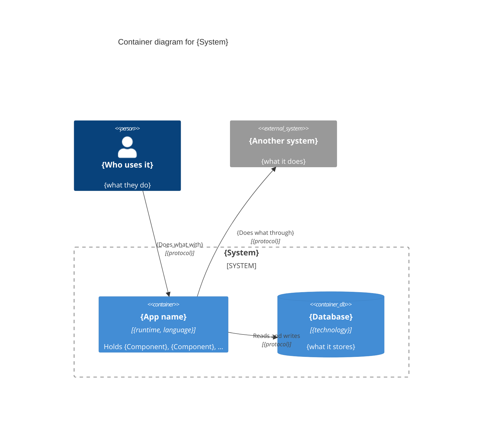
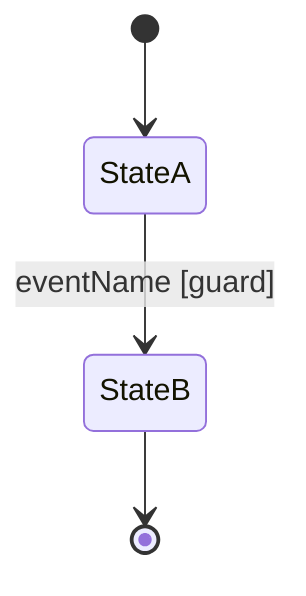
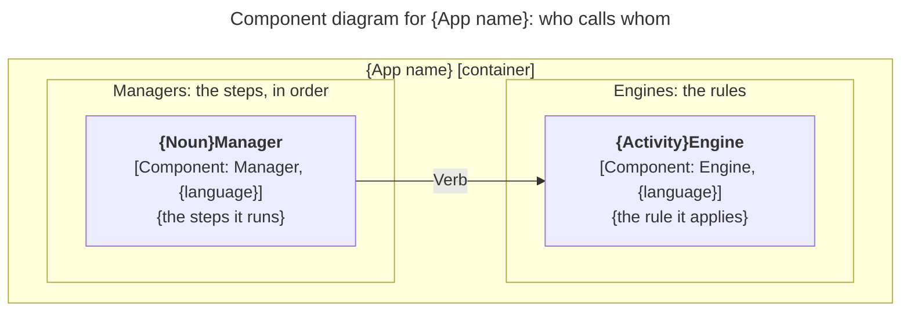

# {System name}: Agent System Design Document

**Source design:** `{name}.design.md` · **Language:** {TypeScript | Go | Rust} · **Status:** draft

## 1. Header & Boundary Box: what gets built, and what doesn't

**System:** {one line: what it does, for whom}
**Target mode:** {modular monolith | event-driven services | …} in {language}, {runtime}, {storage} *(assumed, if the design did not say)*

A C4 container diagram: what runs, and which components each container holds (see
`c4.md`). With a single container, say "Everything runs in one container: {name}" instead.



Key: blue boxes run inside our system; grey boxes are other systems; the figure is a
person. Each container lists the components it holds.

### In scope

- {feature, in the user's words}

### Out of scope (non-goals)

- {rejected candidate, future change, or tempting side quest}

### Decisions carried from the design

- {the design's own assumption, as stated there}

### Decisions added by this spec

Each item was open in the design and is decided here. Review these first.

- {decision}: {chosen value}. If wrong: {what changes}.

Open questions, at most three, also appear inline where they apply:
`[NEEDS CLARIFICATION: {the specific question}]`. Answer them before an agent builds.

### Words used here

One line per technical word this blueprint uses, explained in plain words (see
`plain-language.md`). For example:

- **Invariant**: a rule that must always be true, no matter what happens.
- **Idempotent**: safe to do twice; the second time changes nothing.
- **Encapsulates**: keeps a likely change inside one part, so the rest doesn't notice.

## 2. System Invariants: rules that must always hold

1. **{Rule name}.** {One checkable sentence.} Enforced by `{Component.method}` {in the same
   transaction as {write}}. Violation: `{ERROR_CODE}`.
2. …

(4–7 invariants for most systems; fewer for a small domain. Never pad. Cover
idempotency, immutability, and the hard rejections where they apply.)

## 3. Core Domain Data Contracts: the exact shape of the data

Conventions:

- {IDs are branded strings, so two kinds of ID can't be mixed up.}
- {Money is a whole number of the smallest unit (cents), plus an ISO 4217 currency code.}
- {Times are ISO 8601 strings in UTC.}
- {A `?` marks a field that may be missing.}

```ts
// Identifiers
export type {Thing}Id = string & { readonly __brand: "{Thing}Id" };

// Enumerations and states
export type {Thing}Status = "{a}" | "{b}" | "{c}";

// Records
export interface {Thing} {
  id: {Thing}Id;
  status: {Thing}Status;
  {optionalField}?: string;
}

// Errors
export type ErrorCode = "{ERROR_A}" | "{ERROR_B}";
export type Result<T> = { ok: true; value: T } | { ok: false; error: ErrorCode; detail?: string };
```

### Error catalog

One row per code in `ErrorCode`. The fault column says who must fix it. It's the caller's
fault (a 4xx status) when they sent something the method can't accept. It's ours (a 5xx
status) when our code broke its own promise. Over HTTP, errors use RFC 9457 problem
details (`application/problem+json`), with the code in a `code` field.

| Code | Meaning | Fault | HTTP | Retry helps? |
|------|---------|-------|------|--------------|
| `{ERROR_A}` | {what went wrong} | caller | {409} | no |
| `{ERROR_B}` | {what went wrong} | supplier | {503} | yes, with backoff |

(No HTTP boundary? Drop the HTTP column.)

## 4. State Machines: how things move from one state to the next

### {Thing}Status



Stored by `{Component}`. Each transition is performed by the verb on its arrow, as a
compare-and-set. Anything not drawn is refused: `{INVALID_TRANSITION}`. Terminal:
{states, or "none"}. {If the design names this machine differently: "This is the design's
`{Machine}` machine."}

## 5. Module Boundaries & Interface Signatures: the parts and how to call them

### Module map

```
src/
  contracts/          types from section 3
  {component}/        one folder per component
tests/
  features/           the scenarios from section 6
```

### Component diagram

The design's component diagram, redrawn inside its container, with technology added
(`[Component: Manager, TypeScript]`). Required when there are more than three parts.



Key: light blue, a component; arrows are calls, labelled with the verbs used.

### Entry points (Clients)

#### {Name}

- **Purpose:** {one line}
- **Encapsulates:** {who calls, and how}
- **Constraints:** {how callers prove who they are: a sign-in, an API key, a card and PIN}.
  No business rules.
- **May call:** {one Manager per use case}

```ts
export interface {Name} {
  {entryPoint}(request: {Request}): Promise<{Response}>; // the design's entry points
}
```

- **Failure & retry:** {what the caller sees for each error; whether it may retry}
- **Internals:** {the design's bricks for this part, in backticks as the design spells them}

### Orchestration (Managers)

#### {Noun}Manager

- **Purpose:** {one line}
- **Encapsulates:** {the likely change it contains, in plain words}
- **Constraints:** runs the steps in order; no business rules.
- **May call:** {Engines, ResourceAccess, Utilities; other Managers only through a queue}

```ts
export interface {Noun}Manager {
  {verb}(input: {Input}): Promise<Result<{Output}>>; // errors: {CODE_A}, {CODE_B}
}
```

- **Flow of `{verb}`:**
  1. `{Engine.verb}` …
  2. `{Access.verb}` …
  3. {Only if the design has one:} queue `{OtherManager.verb}` …
- **Failure & retry:** {retryable vs final errors, timeouts, idempotency on retry, races}
- **Internals:** {the design's bricks for this part, in backticks as the design spells them}

### Business rules (Engines)

#### {Activity}Engine

- **Purpose:** …
- **Encapsulates:** …
- **Constraints:** pure and in-memory: no network, storage, clock, or randomness. The
  Manager passes in what it needs.
- **May call:** {Utilities; a read-only ResourceAccess only if the design records one}

```ts
export interface {Activity}Engine { … }
```

- **Failure & retry:** deterministic; returns errors as values; never retried.
- **Internals:** {the design's bricks for this part, in backticks as the design spells them}

### Resource access (ResourceAccess)

#### {Noun}Access

- **Purpose:** …
- **Encapsulates:** {the vendor or storage that may change}
- **Constraints:** the only code that touches {vendor or storage}; exposes business verbs,
  never CRUD or vendor types.
- **May call:** {Resources, Utilities}

```ts
export interface {Noun}Access { … }
```

- **Failure & retry:** {timeouts, which vendor errors are retried, backoff, idempotency key}
- **Internals:** {the design's bricks for this part, in backticks as the design spells them}

### Shared infrastructure (Utilities)

Only a Utility this system builds and the design names. Off-the-shelf logging just gets a
folder in the module map.

#### {Utility}

- **Purpose:** …
- **May call:** nothing

```ts
export interface {Utility} { … }
```

- **Failure & retry:** …

## 6. Agent Verification Suite: tests that say when it's done

```gherkin
Feature: {capability}

  Scenario: {one behavior}
    Given {context with concrete values}
    When {one action}
    Then {observable outcome, with the error code where one applies}

  Scenario Outline: {a family of rejections}
    Given {context}
    When {action with <input>}
    Then the request is rejected with <code>

    Examples:
      | input | code |
      | {x}   | {ERROR_A} |
```

**Verify:** `{npm test -- tests/features}`

**Done when:** every scenario above passes (they fail before the work starts), and every
existing test still passes.
