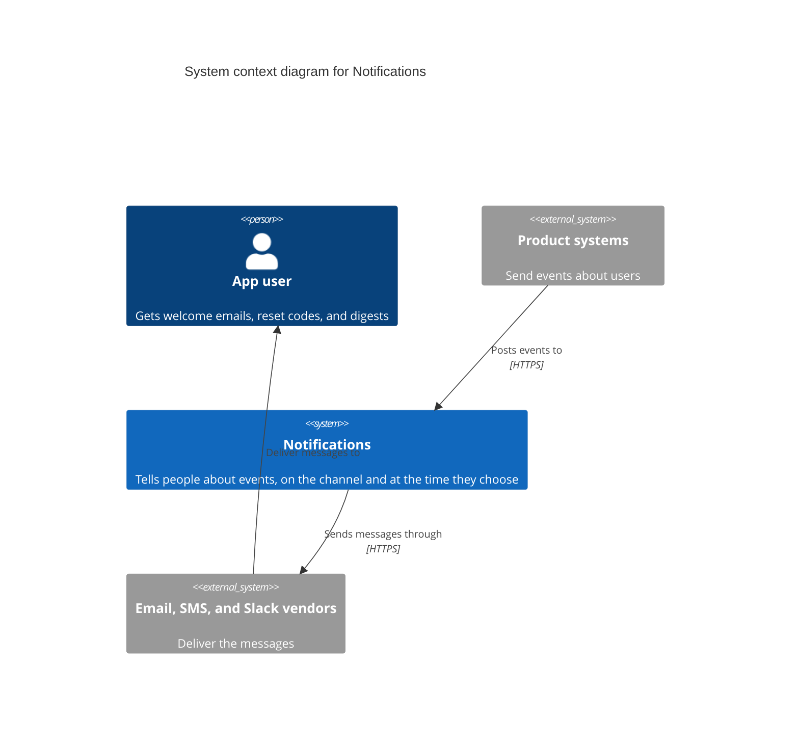
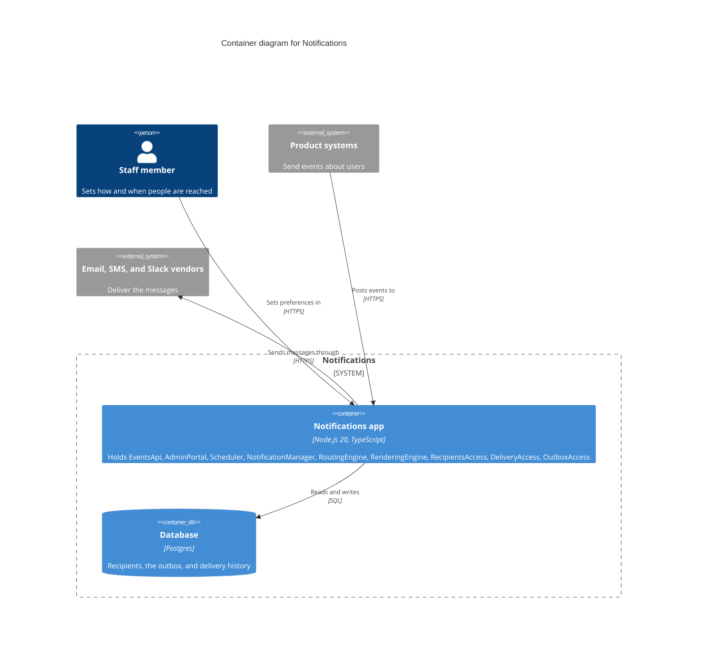
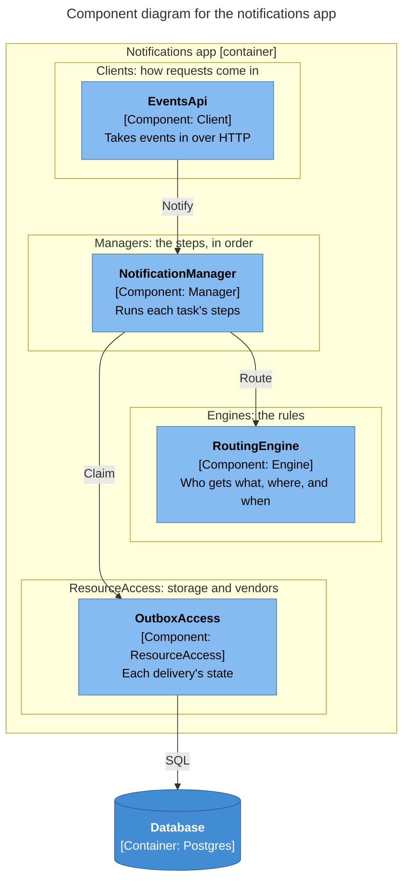

# C4 diagrams

The C4 model (Simon Brown, <https://c4model.com>) is a simple way to draw software at four
levels of zoom. `/decompose` and `/blueprint` use it to draw what they decide. C4 doesn't
decide anything itself: volatility decides where the walls go; C4 is how to show them.

This guide ships with both skills, so their diagrams match.

## The four levels, and who draws what

| C4 level | What it shows | Drawn by | Where |
|----------|---------------|----------|-------|
| 1. System context | the system as one box, the people who use it, and the other systems it talks to | `/decompose` | §1 Frame |
| 2. Container | the things that run: apps, databases, queues | `/blueprint` | section 1, under target mode |
| 3. Component | the parts inside a container, and who calls whom | both: `/decompose` in §4 Walls, `/blueprint` in section 5 | |
| 4. Code | classes and functions | nobody | C4 says generate it on demand or skip it |

C4's own terms, in plain words:

- **Person**: someone who uses the system.
- **Software system**: the thing one team builds and owns.
- **Container**: something that must be running for the system to work: a web app, a
  server app, a database, a queue, a file store, a serverless function. Not a Docker
  container. "Components are not separately deployable units … it's the container that's
  the deployable unit."
- **Component**: a group of related code behind one clear interface, inside a container.
  Managers, Engines, ResourceAccess parts, and Clients are components.

**Why `/decompose` stops at components.** Choosing containers is a deployment decision.
The same walls can run as one app (a modular monolith) or as several services. Simon
Brown: "well-defined components in a monolithic application" are "a stepping stone to a
microservices architecture." So `/decompose` draws its components inside the system's
boundary, and `/blueprint` redraws them inside the container or containers it chooses.

**When to draw the component diagram.** C4 says only when it adds value. In these skills
it usually does, because it shows the walls and the call rules at a glance. A system with
three parts or fewer can skip it; the walls table says the same thing.

## Notation rules (from c4model.com)

1. **Title every diagram with its type and scope**: "System context diagram for
   Notifications", "Component diagram for the notifications app".
2. **Put a key under every diagram**, starting `Key:`. Mermaid's C4 diagrams can't draw a
   legend, so write it in Markdown on the next line.
3. **Name every element's type**: person, software system, container, or component.
4. **Give every element a short description** in plain words, and give containers and
   components a technology. In `/decompose`, where no technology is chosen yet, write the
   part's kind instead (`Manager`, `Engine`).
5. **Every arrow points one way and has a label** that says what happens, matching its
   direction: "Sends messages", not "Uses". Arrows between containers name the protocol
   (`HTTPS`, `SQL`).
6. **Draw each database, bucket, queue, or topic as its own container.** Keep load
   balancers, replicas, and environments off; they belong on a deployment diagram.
7. **One level and one scope per diagram.** Don't mix containers and classes.
8. **Use the same names everywhere**: the diagram, the walls table, and the blueprint's
   section 5.
9. **Plain words** for descriptions and labels (see `plain-language.md`).

## How to write them in Markdown

Mermaid renders on GitHub (it bundles Mermaid 11.17), and its C4 support dates from
Mermaid 9.1.2. Mermaid calls its C4 syntax experimental, and it can't route arrows around
boxes. So:

- **Context and container diagrams** (few boxes): Mermaid's C4 syntax.
- **Component diagrams** (many arrows): a Mermaid flowchart drawn in C4 style, one band
  per layer. C4 is "notation independent", so this is still a C4 diagram.

### System context (Mermaid C4)



Key: blue box, our system; grey boxes, other systems; figure, a person. Arrows show who
calls whom.

`Person` and `System` take `(alias, "label", "description")`. `Container` and `Component`
take `(alias, "label", "technology", "description")`. Boxes are placed in the order they
are written, so write them in the order the arrows flow. `UpdateLayoutConfig($c4ShapeInRow="3",
$c4BoundaryInRow="1")` changes how many boxes sit in a row.

### Container (Mermaid C4)



Key: each container's description lists the components it holds, so every component has a
home. The dashed line is the system's boundary.

### Component (C4-style flowchart)

````

````

- One `subgraph` per layer, top to bottom: Clients, Managers, Engines, ResourceAccess.
  `engines ~~~ access` is an invisible link that keeps Engines above ResourceAccess.
- Each box: `<b>Name</b>`, then `[Component: Kind]` (in `/blueprint`,
  `[Component: Kind, technology]`), then a plain description. The checker reads the name
  from the bold text.
- Each arrow is a call the design allows, labelled with the verbs used.
- Leave Utilities out; everything may call them. Say so in the key.
- In `/decompose`, the outer subgraph is the system (`Notifications [software system]`),
  because containers aren't chosen yet. In `/blueprint`, it is the container.

## Checking

Render every diagram before you hand the document over. Mermaid's C4 syntax is
experimental, and a diagram that doesn't render is worse than none.

- `/blueprint`'s `check_blueprint.py --render` renders each Mermaid block with `mmdc`
  (Mermaid's command-line tool) and fails on any that don't. Its C4 checks also confirm
  that the component diagram names exactly section 5's components, that every arrow obeys
  the call rules, and that every component sits in a container.
- Without `mmdc`, paste the diagram into <https://mermaid.live> and look at it.
