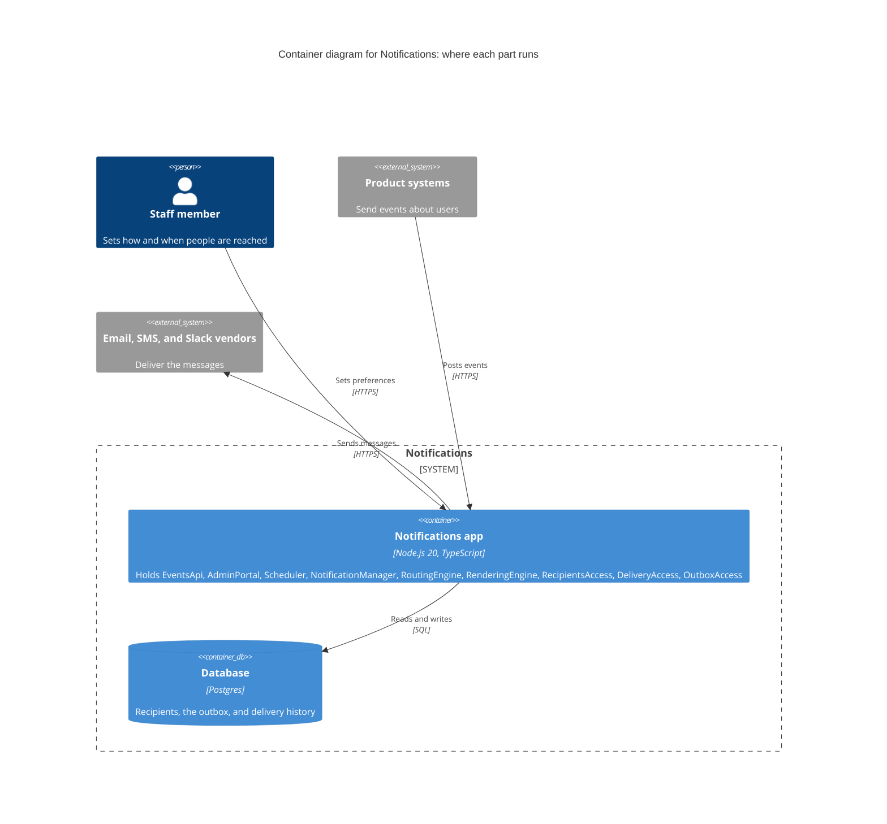
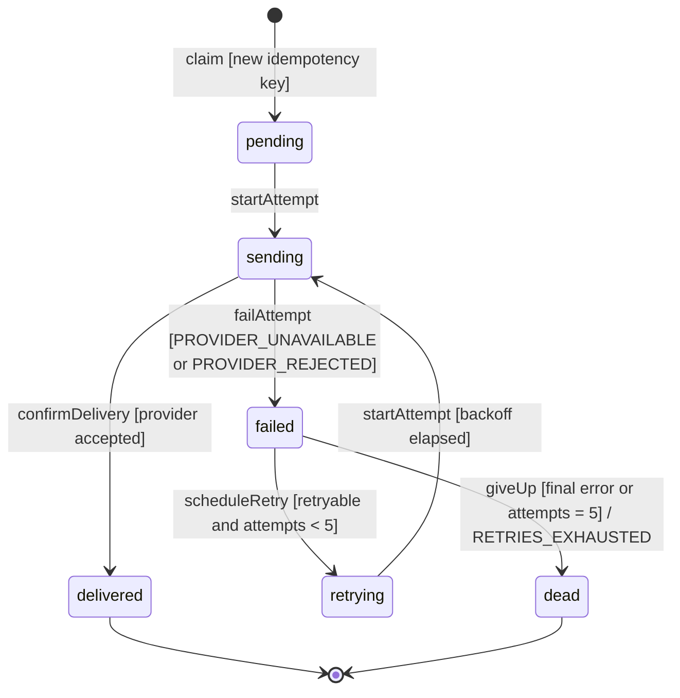
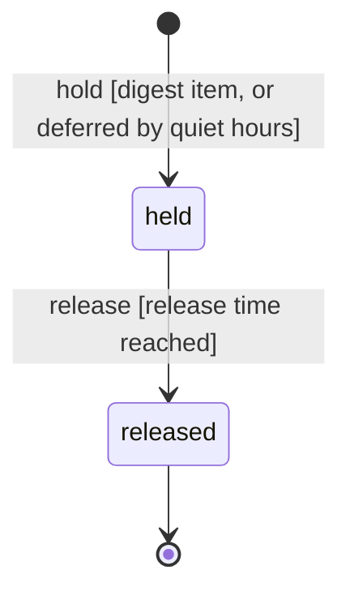
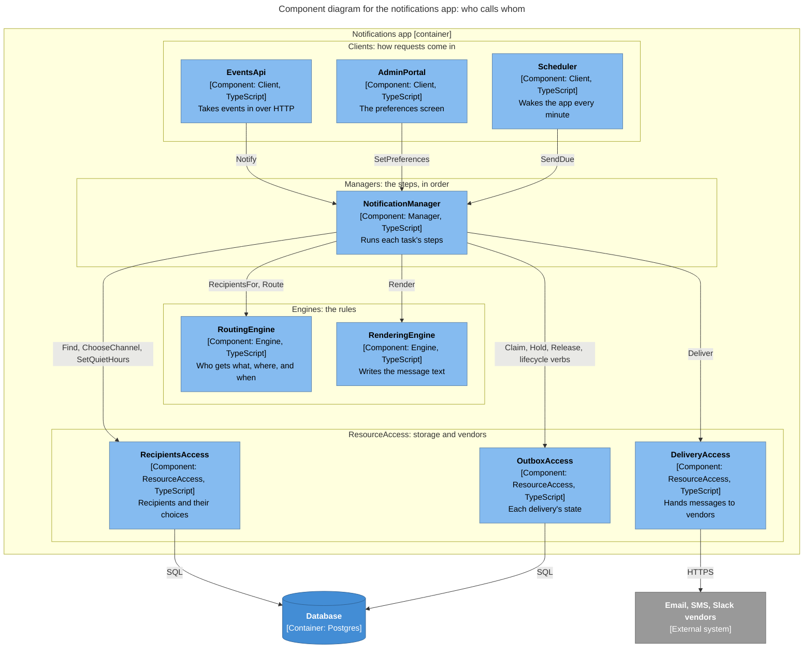

# Notifications: Agent System Design Document

**Source design:** `notifications.design.md` (the worked example in `decompose/references/examples.md`)
· **Language:** TypeScript · **Status:** draft

## 1. Header & Boundary Box: what gets built, and what doesn't

**System:** tells people when something happens in another system. It sends email, SMS,
or Slack messages, in each person's language, on the channel and at the time they choose.
**Target mode:** one app in TypeScript on Node.js 20, with a Postgres database
*(assumed)*. A timer inside the app wakes it every minute.



Key: the blue boxes run inside our system; grey boxes are other systems; the figure is a
person. Each container lists the components it holds. Arrows show who calls whom, and how.

### In scope

- A welcome email when someone signs up.
- A password-reset code by SMS.
- A daily email that sums up what happened (the digest).
- Alerts for the operations team, posted to Slack.
- Each person picks the channel they prefer.
- Quiet hours: nothing that can wait is sent at night.
- If sending fails, try again.
- Messages in each person's language.

### Out of scope (non-goals)

- New channels (WhatsApp, webhooks), opting out, "send a text if the email isn't read",
  and moving recipient data to another system. The design leaves room for each one.
  Don't build them now.
- Marketing campaigns, A/B tests, and analytics.
- A template editor. Templates ship as files inside `RenderingEngine`.
- Fax, and anything else the design ruled out.

### Decisions added by this spec

Each of these was open in the design, so this spec decides it. Check these first.

- Storage is one Postgres database. If wrong: only the ResourceAccess parts change.
- A message is known by `eventId:recipientId:channel`, kept for 30 days. If wrong:
  `OutboxAccess.claim` changes.
- Urgent events are `password.reset` and `alert.*`. Everything else can wait. If wrong:
  one table in `RoutingEngine` changes.
- Quiet hours are 22:00 to 07:00 in the person's own time zone, unless they pick others.
  If wrong: one default changes.
- Try sending up to 5 times. Wait 30 s, then longer each time, up to 1 h, plus a random
  part. If wrong: three numbers in `NotificationManager` change.
- If a message isn't written in the person's language, use English (`en`). If wrong: one
  default in `RenderingEngine` changes.
- The digest goes out at 08:00 in each person's time zone. If wrong: one number in
  `Scheduler` changes.
- Calls to vendors give up after 10 s. Change this once we know how fast the vendors
  really are. If wrong: one number per channel in `DeliveryAccess` changes.
- Times are ISO 8601 strings in UTC. If wrong: the `Instant` type changes.
- Each product system proves who it is with its own API key. If wrong: only `EventsApi`
  changes.
- Staff sign in with the company's sign-in. If wrong: only `AdminPortal` changes.

### Words used here

- **Client, Manager, Engine, ResourceAccess**: the four kinds of part. A Client takes
  requests in. A Manager runs the steps of a task in order. An Engine applies rules. A
  ResourceAccess part talks to storage or an outside service.
- **Envelope**: the record that carries one message through the steps.
- **Outbox**: the table that remembers every message and how far it has got.
- **Invariant**: a rule that must always be true.
- **Idempotent, idempotency**: safe to do twice; the second time changes nothing.
- **Atomic, atomically**: all or nothing. Nothing is left half done.
- **Compare-and-set**: change a value only if it is still what you expect. If someone
  changed it first, refuse.
- **Backoff**: waiting a little longer after each failed try.
- **Jitter**: a random extra wait, so many tries don't all happen at once.
- **Deterministic**: always gives the same answer for the same input.
- **Precondition**: something that must be true before a step can run.
- **Postcondition**: something a step promises is true when it finishes.
- **Payload**: the data sent with a request.
- **Latency**: how long something takes to answer.
- **Orchestration**: running the steps of a task in the right order.
- **Encapsulates**: keeps a likely change inside one part, so the rest doesn't notice.

## 2. System Invariants: rules that must always hold

1. **Each message is sent at most once.** A message is known by
   `eventId:recipientId:channel` *(assumed)*. If the same event comes in again, the app
   returns the first result and sends nothing new. If it comes back with different data,
   it is refused. Enforced by `OutboxAccess.claim`, in the same database transaction that
   saves the message. Violation: `IDEMPOTENCY_CONFLICT`.
2. **Nothing that can wait is sent during quiet hours.** The message is held, then sent
   when quiet hours end. Enforced by `RoutingEngine.route`, which answers "wait until
   then". Reason: `QUIET_HOURS_DEFERRED`.
3. **Every message reaches a channel the person allows, or is refused.** It is never
   quietly dropped. Enforced by `RoutingEngine.route`. Violation: `NO_REACHABLE_CHANNEL`.
4. **A delivery only moves forward.** Once it is `delivered` or `dead`, it never changes.
   Enforced by `OutboxAccess`'s lifecycle verbs (`startAttempt`, `failAttempt`,
   `scheduleRetry`, `giveUp`, `confirmDelivery`). Each one is a compare-and-set on the
   current state. Violation: `INVALID_TRANSITION`.
5. **Tries are limited.** After 5 failed tries *(assumed)*, a delivery is marked `dead`
   and reported. It is never tried again. Enforced by `NotificationManager`, using the
   delivery state machine. Outcome: `RETRIES_EXHAUSTED`.
6. **No message goes out without its text.** Rendering either makes the whole message,
   falling back to English, or fails. Enforced by `RenderingEngine.render`. Violation:
   `TEMPLATE_NOT_FOUND`.

## 3. Core Domain Data Contracts: the exact shape of the data

How the types work. Each kind of ID has its own type, so one can't be passed as another.
Times are ISO 8601 strings in UTC *(assumed)*. A `?` marks a field that may be missing.
Errors come back as values; they are never thrown from one part to another.

```ts
// Identifiers
export type EventId = string & { readonly __brand: "EventId" };
export type RecipientId = string & { readonly __brand: "RecipientId" };
export type DeliveryId = string & { readonly __brand: "DeliveryId" };
export type IdempotencyKey = string & { readonly __brand: "IdempotencyKey" }; // eventId:recipientId:channel
export type Instant = string & { readonly __brand: "Instant" };               // ISO 8601, UTC

// Enumerations
export type Channel = "email" | "sms" | "slack";
export type Urgency = "urgent" | "normal";
export type Locale = string; // BCP 47, e.g. "en", "de-CH"

// What other systems send in
export interface IncomingEvent {
  id: EventId;
  type: string;                     // e.g. "user.created", "password.reset", "alert.disk"
  occurredAt: Instant;
  subjectId?: RecipientId;          // the person the event is about, if any
  data: Record<string, string>;     // template variables
}

// The shared contract every brick passes along
export interface Envelope {
  eventId: EventId;
  eventType: string;
  recipientId: RecipientId;
  urgency: Urgency;
  channel?: Channel;                // set by routing
  locale?: Locale;                  // set by routing
  body?: RenderedMessage;           // set by rendering
  data: Record<string, string>;
}

export interface RenderedMessage {
  subject?: string;                 // email only
  text: string;
  locale: Locale;                   // the locale actually used, after fallback
}

export interface Recipient {
  id: RecipientId;
  timeZone: string;                 // IANA, e.g. "Pacific/Auckland"
  locale: Locale;
  preferredChannels: Channel[];     // in order of preference; may be empty
  contacts: Partial<Record<Channel, string>>;
  quietHours?: { start: string; end: string }; // "22:00", "07:00" local
}

export type RoutingDecision =
  | { kind: "deliver"; envelopes: Envelope[] }
  | { kind: "defer"; until: Instant; reason: "QUIET_HOURS_DEFERRED"; envelopes: Envelope[] }
  | { kind: "reject"; error: "NO_REACHABLE_CHANNEL" };

// Delivery lifecycle
export type DeliveryStatus = "pending" | "sending" | "delivered" | "failed" | "retrying" | "dead";

export interface DeliveryRecord {
  id: DeliveryId;
  key: IdempotencyKey;
  envelope: Envelope;
  status: DeliveryStatus;
  attempts: number;                 // 0..5
  nextAttemptAt?: Instant;          // set while retrying
  receipt?: Receipt;                // set when delivered
  lastError?: ErrorCode;
}

export interface Receipt {
  channel: Channel;
  providerMessageId: string;
  acceptedAt: Instant;
}

// Digest items waiting for their scheduled release
export type HeldItemState = "held" | "released";

// Errors
export type ErrorCode =
  | "IDEMPOTENCY_CONFLICT"
  | "QUIET_HOURS_DEFERRED"
  | "NO_REACHABLE_CHANNEL"
  | "INVALID_TRANSITION"
  | "RETRIES_EXHAUSTED"
  | "TEMPLATE_NOT_FOUND"
  | "PROVIDER_REJECTED"            // the vendor refused the message: final
  | "PROVIDER_UNAVAILABLE"         // timeout, 429, or 5xx from the vendor: retryable
  | "RECIPIENT_NOT_FOUND";

export type Result<T> = { ok: true; value: T } | { ok: false; error: ErrorCode; detail?: string };
```

### Error catalog

Whose fault is it? If the caller broke a precondition, it's the caller's fault (a 4xx
status). If our code broke a promise, it's ours (a 5xx status). Over HTTP, errors use RFC
9457 problem details, with the code in a `code` field.

| Code | Meaning | Fault | HTTP | Retry helps? |
|------|---------|-------|------|--------------|
| `IDEMPOTENCY_CONFLICT` | same event ID replayed with a different payload | caller | 409 | no |
| `QUIET_HOURS_DEFERRED` | not an error: routing held the message until quiet hours end | — | 202 | — |
| `NO_REACHABLE_CHANNEL` | no allowed channel has a contact for the recipient | caller | 422 | no, until the recipient's data changes |
| `INVALID_TRANSITION` | a lifecycle verb was applied to a delivery in the wrong state (a broken precondition, often a lost race) | caller | 409 | no |
| `RETRIES_EXHAUSTED` | a delivery failed 5 times and is dead | supplier (vendor) | — (internal) | no |
| `TEMPLATE_NOT_FOUND` | no template exists for the event type | supplier | 500 | no, until a template ships |
| `PROVIDER_REJECTED` | the vendor refused the message | caller data or vendor | — (internal) | no |
| `PROVIDER_UNAVAILABLE` | the vendor timed out or answered 408, 429, or 5xx | vendor | — (internal) | yes, with backoff |
| `RECIPIENT_NOT_FOUND` | no recipient has that ID | caller | 404 | no |

## 4. State Machines: how things move from one state to the next

### DeliveryStatus



Stored by `OutboxAccess`. Each arrow is done by the verb written on it, as a
compare-and-set. Any move that isn't drawn is refused with `INVALID_TRANSITION`. Final
states: `delivered` and `dead`.

### HeldItemState



Stored by `OutboxAccess`. `release` moves every item that is due, all in one
transaction. A released item can't be held again: `INVALID_TRANSITION`.

## 5. Module Boundaries & Interface Signatures: the parts and how to call them

### Module map

```
src/
  contracts/                  section 3 types, shared by all modules
  entry/events-api/           EventsApi (HTTP)
  entry/admin-portal/         AdminPortal (HTTP)
  entry/scheduler/            Scheduler (in-process timer)
  notification-manager/       flows and the delivery state machine
  routing-engine/             routing policies: expand, prefer, quiet hours
  rendering-engine/           templates/ and render
  recipients-access/          recipient profiles and preferences
  delivery-access/            email, sms, slack transports
  outbox-access/              outbox, delivery records, held items
  infra/                      logging, secrets, pub/sub
tests/
  features/                   section 6 scenarios
```

### Component diagram

Every part of the app, one layer per band, and who calls whom. Each arrow is a call the
design allows; the labels are the verbs used.



Key: light blue, a component in the app; dark blue, the database; grey, another system.
Bands run top to bottom: Clients, Managers, Engines, ResourceAccess. Arrows are calls, and
their labels are the verbs used. Utilities (logging, secrets) are left out: every part may
call them.

### Entry points (Clients)

#### EventsApi

- **Purpose:** receives events that other systems post over HTTP.
- **Encapsulates:** which systems send events, and how.
- **Constraints:** each product system proves who it is with its own API key *(assumed)*.
  Validates and forwards only; no routing or rendering. Calls one Manager.
- **May call:** `NotificationManager`, infrastructure.

```ts
// POST /events  body: IncomingEvent  →  202 { accepted: number }
// errors: application/problem+json with a `code` member; status from the error catalog
export interface EventsApi {
  receive(event: IncomingEvent): Promise<Result<{ accepted: number }>>;
}
```

- **Failure & retry:** returns 202 once the event's deliveries are claimed; a replay of the
  same event returns 202 with the same count. Callers may retry on timeout or 5xx.
- **Internals:** `OnEvent(type)`, which parses the request body into an `IncomingEvent`.

#### Scheduler

- **Purpose:** fires the digest release every morning, and wakes due retries.
- **Encapsulates:** when things run.
- **Constraints:** a timer only; calls one Manager per tick.
- **May call:** `NotificationManager`.

```ts
export interface Scheduler {
  onTick(now: Instant): Promise<void>; // every minute
}
```

- **Failure & retry:** a failed tick is logged and the next tick tries again; the Manager's
  methods are idempotent, so overlapping ticks are safe.
- **Internals:** `OnSchedule(cron)`: the digest release at 08:00 local time *(assumed)*, and
  a one-minute tick for due retries.

#### AdminPortal

- **Purpose:** lets people choose their channel and quiet hours.
- **Encapsulates:** the preferences UI.
- **Constraints:** staff sign in with the company's sign-in *(assumed)*. Calls one Manager
  per action.
- **May call:** `NotificationManager`.

```ts
export interface AdminPortal {
  savePreferences(recipientId: RecipientId, channels: Channel[], quietHours?: { start: string; end: string }):
    Promise<Result<void>>; // RECIPIENT_NOT_FOUND
}
```

- **Failure & retry:** validation errors return 400; storage errors return 503 and are safe
  to retry.

### Orchestration (Managers)

#### NotificationManager

- **Purpose:** runs the notification flows and the delivery lifecycle.
- **Encapsulates:** the delivery flows: immediate, digest, and later escalation.
- **Constraints:** orchestration only; every business rule lives in an Engine.
- **May call:** `RoutingEngine`, `RenderingEngine`, `RecipientsAccess`, `DeliveryAccess`,
  `OutboxAccess`, infrastructure.

```ts
export interface NotificationManager {
  notify(event: IncomingEvent): Promise<Result<{ accepted: number }>>;  // IDEMPOTENCY_CONFLICT, NO_REACHABLE_CHANNEL, TEMPLATE_NOT_FOUND
  sendDue(now: Instant): Promise<Result<{ sent: number }>>;             // held items and due retries
  setPreferences(recipientId: RecipientId, channels: Channel[],
                 quietHours?: { start: string; end: string }): Promise<Result<void>>; // RECIPIENT_NOT_FOUND
}
```

- **Flow of `notify`:**
  1. `RoutingEngine.recipientsFor(event)`, then `RecipientsAccess.find(ids)`.
  2. `RoutingEngine.route(event, recipients, now)` gives deliver, defer, or reject.
  3. On reject, return `NO_REACHABLE_CHANNEL`.
  4. For each envelope, `OutboxAccess.claim(key, envelope)`. An existing key with the same
     payload is skipped; a different payload returns `IDEMPOTENCY_CONFLICT`.
  5. On defer, or for a digest event, `OutboxAccess.hold(key, releaseAt)` and stop.
  6. `RenderingEngine.render(envelope)`.
  7. `OutboxAccess.startAttempt`, then `DeliveryAccess.deliver`; then
     `OutboxAccess.confirmDelivery`, or `OutboxAccess.failAttempt` and the retry policy
     (`scheduleRetry` or `giveUp`).
- **Flow of `sendDue`:** `OutboxAccess.release(now)` for held items, then steps 6–7 for each;
  then `OutboxAccess.dueRetries(now)` and steps 6–7 for each.
- **Flow of `setPreferences`:** `RecipientsAccess.chooseChannel`, then
  `RecipientsAccess.setQuietHours`.
- **Failure & retry:** `PROVIDER_UNAVAILABLE` is retryable: attempt `n` waits a random time
  up to `min(1 h, 30 s × 2^n)`. `PROVIDER_REJECTED` is final. After 5 attempts the
  delivery becomes `dead` with `RETRIES_EXHAUSTED` and is logged. Two workers racing on
  one delivery are resolved by the compare-and-set in `OutboxAccess.startAttempt`; the
  loser gets `INVALID_TRANSITION` and moves on.
- **Internals:** the `Delivery` state machine (section 4) and one flow per use case.

### Business rules (Engines)

#### RoutingEngine

- **Purpose:** decides who gets a message, on which channel, and when.
- **Encapsulates:** preferences, quiet hours, and regional rules, which differ by customer.
- **Constraints:** pure and in-memory: no network, storage, clock, or randomness. The
  current time and recipient data are passed in.
- **May call:** infrastructure only. The Manager passes recipients in, as in the design.

```ts
export interface RoutingEngine {
  recipientsFor(event: IncomingEvent): RecipientId[];
  route(event: IncomingEvent, recipients: Recipient[], now: Instant): RoutingDecision; // NO_REACHABLE_CHANNEL
}
```

- **Failure & retry:** deterministic; returns `NO_REACHABLE_CHANNEL` as a value; never
  retried.
- **Internals:** policies applied in order: `Expand` (event to recipients), `Prefer`
  (channel), `QuietHours` (hold what can wait). Only `password.reset` and `alert.*` are
  urgent *(assumed)*. Quiet hours default to 22:00 to 07:00 in the person's own time zone
  *(assumed)*.

#### RenderingEngine

- **Purpose:** turns an envelope and a template into the message text.
- **Encapsulates:** message content, templates, and languages.
- **Constraints:** pure; templates are loaded once at startup from `templates/`.
- **May call:** infrastructure.

```ts
export interface RenderingEngine {
  render(envelope: Envelope): Result<RenderedMessage>; // TEMPLATE_NOT_FOUND
}
```

- **Failure & retry:** falls back to English when the recipient's language is missing
  *(assumed)*; `TEMPLATE_NOT_FOUND` when the template itself is missing. Never retried.

### Resource access (ResourceAccess)

#### RecipientsAccess

- **Purpose:** reads and updates recipient profiles and preferences.
- **Encapsulates:** where recipient data lives (the system's own database now, a CRM later).
- **Constraints:** the only code that touches recipient storage.
- **May call:** storage, infrastructure.

```ts
export interface RecipientsAccess {
  find(ids: RecipientId[]): Promise<Result<Recipient[]>>;
  chooseChannel(id: RecipientId, channels: Channel[]): Promise<Result<void>>;             // RECIPIENT_NOT_FOUND
  setQuietHours(id: RecipientId, hours?: { start: string; end: string }): Promise<Result<void>>; // RECIPIENT_NOT_FOUND
}
```

- **Failure & retry:** 2 s timeout; storage errors are retried twice with jitter, then
  returned as `PROVIDER_UNAVAILABLE`.

#### DeliveryAccess

- **Purpose:** hands a rendered message to the right vendor.
- **Encapsulates:** which channels exist and which vendor delivers each.
- **Constraints:** the only code that touches email, SMS, or Slack vendors; no business
  decisions.
- **May call:** vendor APIs, secrets, infrastructure.

```ts
export interface DeliveryAccess {
  deliver(envelope: Envelope): Promise<Result<Receipt>>; // PROVIDER_UNAVAILABLE, PROVIDER_REJECTED
}
```

- **Failure & retry:** 10 s timeout per call *(assumed)*. Timeouts, 408, 429, and 5xx become
  `PROVIDER_UNAVAILABLE`, other 4xx become `PROVIDER_REJECTED`. A `Retry-After` from the
  vendor is passed back so the Manager can honor it. It never retries itself; the Manager
  owns retries, so retries happen at one layer only. The idempotency key is sent to vendors that accept one.
- **Internals:** one transport per channel: `Email`, `Sms`, `Slack`.

#### OutboxAccess

- **Purpose:** keeps every delivery's state, and the held digest items.
- **Encapsulates:** how delivery state is stored.
- **Constraints:** the only code that touches the outbox tables; enforces idempotency and
  forward-only transitions atomically.
- **May call:** storage, infrastructure.

```ts
export interface OutboxAccess {
  claim(key: IdempotencyKey, envelope: Envelope): Promise<Result<DeliveryRecord>>;     // IDEMPOTENCY_CONFLICT
  startAttempt(id: DeliveryId): Promise<Result<DeliveryRecord>>;                     // INVALID_TRANSITION
  failAttempt(id: DeliveryId, error: ErrorCode): Promise<Result<DeliveryRecord>>;      // INVALID_TRANSITION
  scheduleRetry(id: DeliveryId, at: Instant): Promise<Result<DeliveryRecord>>;         // INVALID_TRANSITION
  giveUp(id: DeliveryId): Promise<Result<DeliveryRecord>>;                             // INVALID_TRANSITION
  hold(key: IdempotencyKey, releaseAt: Instant): Promise<Result<void>>;
  release(now: Instant): Promise<Result<DeliveryRecord[]>>;
  dueRetries(now: Instant): Promise<Result<DeliveryRecord[]>>;
  confirmDelivery(id: DeliveryId, receipt: Receipt): Promise<Result<DeliveryRecord>>;  // INVALID_TRANSITION
}
```

- **Failure & retry:** `claim` inserts with a unique key; on conflict it compares payloads
  and returns the existing record or `IDEMPOTENCY_CONFLICT`. Each lifecycle verb updates
  only where the current state is the one its arrow starts from, otherwise
  `INVALID_TRANSITION`. Storage errors are retried twice with jitter.

## 6. Agent Verification Suite: tests that say when it's done

```gherkin
Feature: Notifications are delivered once, on the right channel, at the right time

  Background:
    Given recipient "r-1" prefers "email" then "sms", speaks "de", lives in "Europe/Berlin"
    And recipient "r-1" has quiet hours from "22:00" to "07:00"

  Scenario Outline: Replaying an event is safe
    Given event "e-100" of type "user.created" about "r-1" was delivered by email
    When event "e-100" arrives again with <payload>
    Then <outcome>

    Examples:
      | payload        | outcome                                                  |
      | the same data  | the response reports 1 accepted delivery and nothing new is sent |
      | different data | the request is rejected with IDEMPOTENCY_CONFLICT        |

  Scenario: A non-urgent message waits for quiet hours to end
    Given the time is "2026-03-02T22:30:00Z", which is 23:30 in Berlin
    When event "e-102" of type "comment.added" about "r-1" arrives
    Then routing defers it with QUIET_HOURS_DEFERRED until "2026-03-03T06:00:00Z"
    And no message is sent to "r-1" before then

  Scenario Outline: Messages that cannot be sent are rejected, never dropped
    Given <setup>
    When event "<event>" of type "<type>" arrives
    Then the request is rejected with <code>

    Examples:
      | setup                                          | event | type            | code                 |
      | recipient "r-2" has no contacts on any channel | e-103 | password.reset  | NO_REACHABLE_CHANNEL |
      | there is no template for "invoice.overdue"      | e-104 | invoice.overdue | TEMPLATE_NOT_FOUND   |

  Scenario: A delivery that keeps failing ends dead
    Given the SMS vendor answers every request with HTTP 503
    When event "e-105" of type "password.reset" about "r-2" has been attempted 5 times by SMS
    Then the delivery status is "dead" with RETRIES_EXHAUSTED
    And no further attempt is scheduled

  Scenario Outline: Final states never change
    Given a delivery in status "<from>"
    When something tries to move it to "<to>"
    Then the change is refused with INVALID_TRANSITION
    And its status is still "<from>"

    Examples:
      | from      | to      |
      | delivered | sending |
      | dead      | retrying |
```

**Verify:** `npm test -- tests/features`

**Done when:** every scenario above passes (they fail before the work starts), and every
existing test still passes.
