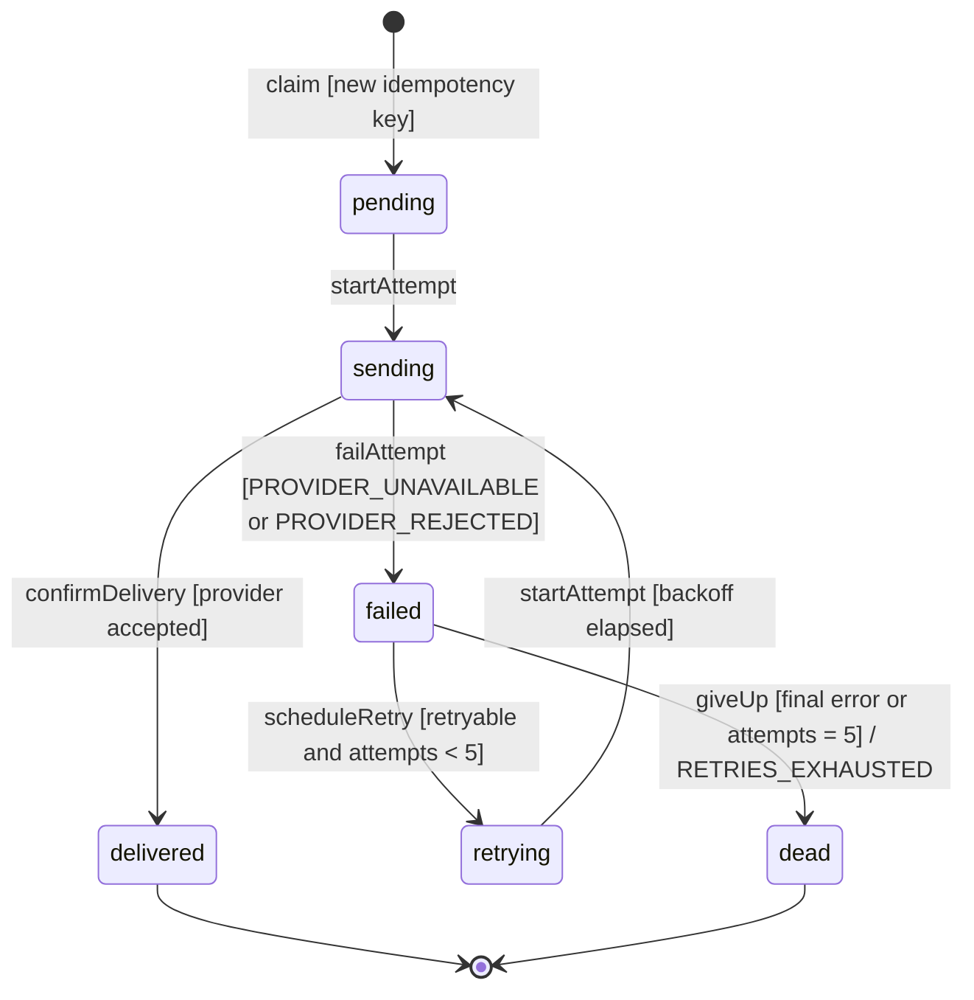
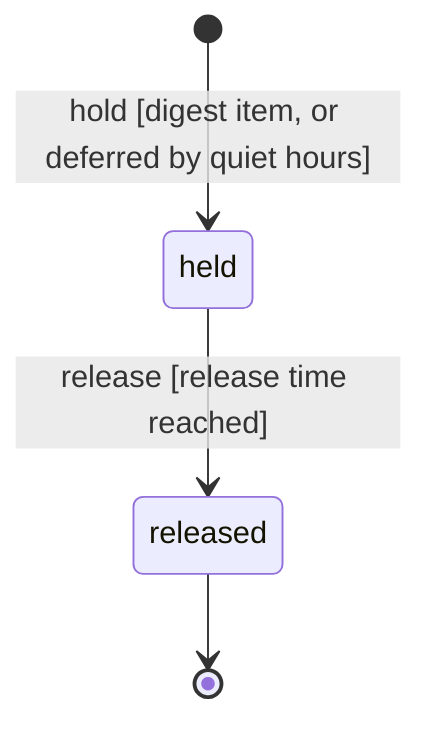

# Notifications: Agent System Design Document

**Source design:** `notifications.design.md` (the worked example in `decompose/references/examples.md`)
· **Language:** TypeScript · **Status:** draft

## 1. Header & Boundary Box

**System:** tells people about events in other systems, by email, SMS, or Slack, in their
language, on the channel and at the time they prefer.
**Target mode:** modular monolith in TypeScript on Node.js 20, Postgres for storage *(assumed)*,
one process with an in-process scheduler.

### In scope

- Welcome email when someone signs up.
- Password-reset code by SMS.
- Daily digest email of activity.
- Ops alerts posted to Slack.
- Each user picks their preferred channel.
- Quiet hours: nothing non-urgent at night.
- Failed deliveries are retried.
- Messages in the user's language.

### Out of scope (non-goals)

- New channels (WhatsApp, webhooks), opt-out management, escalate-if-unread flows, and
  moving recipient data to a CRM. The design absorbs each of these later; don't build them.
- Marketing campaigns, A/B tests, and analytics.
- A template editor. Templates ship as files with the rendering module.
- Fax, or anything else the design rejected as speculative.

### Decisions added by this spec

Each item was open in the design and is decided here. Review these first.

- Storage is Postgres; the outbox and delivery records share one database. If wrong: only
  the ResourceAccess implementations change.
- Idempotency key is `eventId:recipientId:channel`, kept 30 days. If wrong: the key format
  in `OutboxAccess.claim` changes.
- Urgent events are `password.reset` and `alert.*`; everything else is non-urgent. If
  wrong: the urgency table in `RoutingEngine` changes.
- Default quiet hours are 22:00–07:00 in the recipient's time zone. If wrong: one default.
- At most 5 delivery attempts, exponential backoff from 30 s capped at 1 h, full jitter. If
  wrong: three constants in `NotificationManager`.
- Fallback language is English (`en`). If wrong: one default in `RenderingEngine`.
- Vendor calls time out after 10 s, until the vendors' p99.9 latency is measured. If
  wrong: one constant per transport in `DeliveryAccess`.
- Timestamps are ISO 8601 UTC strings. If wrong: the `Instant` type.

## 2. System Invariants

1. **Each message is delivered at most once.** A message is identified by
   `eventId:recipientId:channel` *(assumed)*. Replaying the same event returns the original
   receipt and sends nothing. Replaying the same key with a different payload is refused.
   Enforced by `OutboxAccess.claim`, in the same transaction as the outbox insert.
   Violation: `IDEMPOTENCY_CONFLICT`.
2. **No non-urgent message is delivered during the recipient's quiet hours.** It is held
   and released when quiet hours end. Enforced by `RoutingEngine.route`, which returns a
   deferral. Deferral reason: `QUIET_HOURS_DEFERRED`.
3. **Every message reaches at least one channel the recipient allows, or is rejected.** It
   is never dropped silently. Enforced by `RoutingEngine.route`. Violation:
   `NO_REACHABLE_CHANNEL`.
4. **A delivery's history only moves forward.** `delivered` and `dead` are final and never
   change. Enforced by `OutboxAccess`'s lifecycle verbs (`startAttempt`, `failAttempt`,
   `scheduleRetry`, `giveUp`, `confirmDelivery`), each a compare-and-set on the current
   state. Violation: `INVALID_TRANSITION`.
5. **Retries are bounded.** After 5 failed attempts *(assumed)* a delivery becomes `dead`
   and is reported, never retried again. Enforced by `NotificationManager` through the
   delivery state machine. Outcome: `RETRIES_EXHAUSTED`.
6. **A message is never sent without its content.** Rendering either produces the full
   message, falling back to English, or fails. Enforced by `RenderingEngine.render`.
   Violation: `TEMPLATE_NOT_FOUND`.

## 3. Core Domain Data Contracts

Conventions: IDs are branded strings; timestamps are ISO 8601 UTC strings *(assumed)*;
optional fields are marked `?`; errors are values, never thrown across a module boundary.

```ts
// Identifiers
export type EventId = string & { readonly __brand: "EventId" };
export type RecipientId = string & { readonly __brand: "RecipientId" };
export type DeliveryId = string & { readonly __brand: "DeliveryId" };
export type IdempotencyKey = string & { readonly __brand: "IdempotencyKey" }; // eventId:recipientId:channel
export type Instant = string & { readonly __brand: "Instant" };               // ISO 8601, UTC

// Enumerations
export type Channel = "email" | "sms" | "slack";
export type Urgency = "urgent" | "normal";
export type Locale = string; // BCP 47, e.g. "en", "de-CH"

// What other systems send in
export interface IncomingEvent {
  id: EventId;
  type: string;                     // e.g. "user.created", "password.reset", "alert.disk"
  occurredAt: Instant;
  subjectId?: RecipientId;          // the person the event is about, if any
  data: Record<string, string>;     // template variables
}

// The shared contract every brick passes along
export interface Envelope {
  eventId: EventId;
  eventType: string;
  recipientId: RecipientId;
  urgency: Urgency;
  channel?: Channel;                // set by routing
  locale?: Locale;                  // set by routing
  body?: RenderedMessage;           // set by rendering
  data: Record<string, string>;
}

export interface RenderedMessage {
  subject?: string;                 // email only
  text: string;
  locale: Locale;                   // the locale actually used, after fallback
}

export interface Recipient {
  id: RecipientId;
  timeZone: string;                 // IANA, e.g. "Pacific/Auckland"
  locale: Locale;
  preferredChannels: Channel[];     // in order of preference; may be empty
  contacts: Partial<Record<Channel, string>>;
  quietHours?: { start: string; end: string }; // "22:00", "07:00" local
}

export type RoutingDecision =
  | { kind: "deliver"; envelopes: Envelope[] }
  | { kind: "defer"; until: Instant; reason: "QUIET_HOURS_DEFERRED"; envelopes: Envelope[] }
  | { kind: "reject"; error: "NO_REACHABLE_CHANNEL" };

// Delivery lifecycle
export type DeliveryStatus = "pending" | "sending" | "delivered" | "failed" | "retrying" | "dead";

export interface DeliveryRecord {
  id: DeliveryId;
  key: IdempotencyKey;
  envelope: Envelope;
  status: DeliveryStatus;
  attempts: number;                 // 0..5
  nextAttemptAt?: Instant;          // set while retrying
  receipt?: Receipt;                // set when delivered
  lastError?: ErrorCode;
}

export interface Receipt {
  channel: Channel;
  providerMessageId: string;
  acceptedAt: Instant;
}

// Digest items waiting for their scheduled release
export type HeldItemState = "held" | "released";

// Errors
export type ErrorCode =
  | "IDEMPOTENCY_CONFLICT"
  | "QUIET_HOURS_DEFERRED"
  | "NO_REACHABLE_CHANNEL"
  | "INVALID_TRANSITION"
  | "RETRIES_EXHAUSTED"
  | "TEMPLATE_NOT_FOUND"
  | "PROVIDER_REJECTED"            // the vendor refused the message: final
  | "PROVIDER_UNAVAILABLE"         // timeout, 429, or 5xx from the vendor: retryable
  | "RECIPIENT_NOT_FOUND";

export type Result<T> = { ok: true; value: T } | { ok: false; error: ErrorCode; detail?: string };
```

### Error catalog

Fault follows design by contract: a broken precondition is the caller's fault (4xx), a
broken postcondition or invariant is the supplier's (5xx). Over HTTP, errors are RFC 9457
problem details with the code in a `code` member.

| Code | Meaning | Fault | HTTP | Retry helps? |
|------|---------|-------|------|--------------|
| `IDEMPOTENCY_CONFLICT` | same event ID replayed with a different payload | caller | 409 | no |
| `QUIET_HOURS_DEFERRED` | not an error: routing held the message until quiet hours end | — | 202 | — |
| `NO_REACHABLE_CHANNEL` | no allowed channel has a contact for the recipient | caller | 422 | no, until the recipient's data changes |
| `INVALID_TRANSITION` | a lifecycle verb was applied to a delivery in the wrong state | supplier | 409 | no |
| `RETRIES_EXHAUSTED` | a delivery failed 5 times and is dead | supplier (vendor) | — (internal) | no |
| `TEMPLATE_NOT_FOUND` | no template exists for the event type | supplier | 500 | no, until a template ships |
| `PROVIDER_REJECTED` | the vendor refused the message | caller data or vendor | — (internal) | no |
| `PROVIDER_UNAVAILABLE` | the vendor timed out or answered 408, 429, or 5xx | vendor | — (internal) | yes, with backoff |
| `RECIPIENT_NOT_FOUND` | no recipient has that ID | caller | 404 | no |

## 4. State Machines

### DeliveryStatus



Stored by `OutboxAccess`. Each transition is the lifecycle verb on its arrow, performed as a
compare-and-set on the current state. Any other transition: `INVALID_TRANSITION`.
Terminal: `delivered`, `dead`.

### HeldItemState



Stored by `OutboxAccess`. `release` moves every due item in one transaction; a released item
can't be held again: `INVALID_TRANSITION`.

## 5. Module Boundaries & Interface Signatures

### Module map

```
src/
  contracts/                  section 3 types, shared by all modules
  entry/events-api/           EventsApi (HTTP)
  entry/admin-portal/         AdminPortal (HTTP)
  entry/scheduler/            Scheduler (in-process timer)
  notification-manager/       flows and the delivery state machine
  routing-engine/             routing policies: expand, prefer, quiet hours
  rendering-engine/           templates/ and render
  recipients-access/          recipient profiles and preferences
  delivery-access/            email, sms, slack transports
  outbox-access/              outbox, delivery records, held items
  infra/                      logging, secrets, pub/sub
tests/
  features/                   section 6 scenarios
```

### Entry points (Clients)

#### EventsApi

- **Purpose:** receives events that other systems post over HTTP.
- **Encapsulates:** which systems send events, and how.
- **Constraints:** validates and forwards only; no routing or rendering. Calls one Manager.
- **May call:** `NotificationManager`, infrastructure.

```ts
// POST /events  body: IncomingEvent  →  202 { accepted: number }
// errors: application/problem+json with a `code` member; status from the error catalog
export interface EventsApi {
  receive(event: IncomingEvent): Promise<Result<{ accepted: number }>>;
}
```

- **Failure & retry:** returns 202 once the event's deliveries are claimed; a replay of the
  same event returns 202 with the same count. Callers may retry on timeout or 5xx.

#### Scheduler

- **Purpose:** fires the digest release every morning, and wakes due retries.
- **Encapsulates:** when things run.
- **Constraints:** a timer only; calls one Manager per tick.
- **May call:** `NotificationManager`.

```ts
export interface Scheduler {
  onTick(now: Instant): Promise<void>; // every minute
}
```

- **Failure & retry:** a failed tick is logged and the next tick tries again; the Manager's
  methods are idempotent, so overlapping ticks are safe.

#### AdminPortal

- **Purpose:** lets people choose their channel and quiet hours.
- **Encapsulates:** the preferences UI.
- **Constraints:** calls one Manager per action.
- **May call:** `NotificationManager`.

```ts
export interface AdminPortal {
  savePreferences(recipientId: RecipientId, channels: Channel[], quietHours?: { start: string; end: string }):
    Promise<Result<void>>; // RECIPIENT_NOT_FOUND
}
```

- **Failure & retry:** validation errors return 400; storage errors return 503 and are safe
  to retry.

### Orchestration (Managers)

#### NotificationManager

- **Purpose:** runs the notification flows and the delivery lifecycle.
- **Encapsulates:** the delivery flows: immediate, digest, and later escalation.
- **Constraints:** orchestration only; every business rule lives in an Engine.
- **May call:** `RoutingEngine`, `RenderingEngine`, `RecipientsAccess`, `DeliveryAccess`,
  `OutboxAccess`, infrastructure.

```ts
export interface NotificationManager {
  notify(event: IncomingEvent): Promise<Result<{ accepted: number }>>;  // IDEMPOTENCY_CONFLICT, NO_REACHABLE_CHANNEL, TEMPLATE_NOT_FOUND
  sendDue(now: Instant): Promise<Result<{ sent: number }>>;             // held items and due retries
  setPreferences(recipientId: RecipientId, channels: Channel[],
                 quietHours?: { start: string; end: string }): Promise<Result<void>>; // RECIPIENT_NOT_FOUND
}
```

- **Flow of `notify`:**
  1. `RoutingEngine.recipientsFor(event)`, then `RecipientsAccess.find(ids)`.
  2. `RoutingEngine.route(event, recipients, now)` gives deliver, defer, or reject.
  3. On reject, return `NO_REACHABLE_CHANNEL`.
  4. For each envelope, `OutboxAccess.claim(key, envelope)`. An existing key with the same
     payload is skipped; a different payload returns `IDEMPOTENCY_CONFLICT`.
  5. On defer, or for a digest event, `OutboxAccess.hold(key, releaseAt)` and stop.
  6. `RenderingEngine.render(envelope)`.
  7. `OutboxAccess.startAttempt`, then `DeliveryAccess.deliver`; then
     `OutboxAccess.confirmDelivery`, or `OutboxAccess.failAttempt` and the retry policy
     (`scheduleRetry` or `giveUp`).
- **Flow of `sendDue`:** `OutboxAccess.release(now)` for held items, then steps 6–7 for each;
  then `OutboxAccess.dueRetries(now)` and steps 6–7 for each.
- **Flow of `setPreferences`:** `RecipientsAccess.chooseChannel`, then
  `RecipientsAccess.setQuietHours`.
- **Failure & retry:** `PROVIDER_UNAVAILABLE` is retryable: attempt `n` waits a random time
  up to `min(1 h, 30 s × 2^n)` *(assumed)*. `PROVIDER_REJECTED` is final. After 5 attempts the
  delivery becomes `dead` with `RETRIES_EXHAUSTED` and is logged. Two workers racing on
  one delivery are resolved by the compare-and-set in `OutboxAccess.startAttempt`; the
  loser gets `INVALID_TRANSITION` and moves on.
- **Internals:** the `Delivery` state machine (section 4) and one flow per use case.

### Business rules (Engines)

#### RoutingEngine

- **Purpose:** decides who gets a message, on which channel, and when.
- **Encapsulates:** preferences, quiet hours, and regional rules, which differ by customer.
- **Constraints:** pure and in-memory: no network, storage, clock, or randomness. The
  current time and recipient data are passed in.
- **May call:** infrastructure only. The Manager passes recipients in, as in the design.

```ts
export interface RoutingEngine {
  recipientsFor(event: IncomingEvent): RecipientId[];
  route(event: IncomingEvent, recipients: Recipient[], now: Instant): RoutingDecision; // NO_REACHABLE_CHANNEL
}
```

- **Failure & retry:** deterministic; returns `NO_REACHABLE_CHANNEL` as a value; never
  retried.
- **Internals:** policies applied in order: `Expand` (event to recipients), `Prefer`
  (channel), `QuietHours` (defer non-urgent).

#### RenderingEngine

- **Purpose:** turns an envelope and a template into the message text.
- **Encapsulates:** message content, templates, and languages.
- **Constraints:** pure; templates are loaded once at startup from `templates/`.
- **May call:** infrastructure.

```ts
export interface RenderingEngine {
  render(envelope: Envelope): Result<RenderedMessage>; // TEMPLATE_NOT_FOUND
}
```

- **Failure & retry:** falls back to English when the recipient's language is missing
  *(assumed)*; `TEMPLATE_NOT_FOUND` when the template itself is missing. Never retried.

### Resource access (ResourceAccess)

#### RecipientsAccess

- **Purpose:** reads and updates recipient profiles and preferences.
- **Encapsulates:** where recipient data lives (the system's own database now, a CRM later).
- **Constraints:** the only code that touches recipient storage.
- **May call:** storage, infrastructure.

```ts
export interface RecipientsAccess {
  find(ids: RecipientId[]): Promise<Result<Recipient[]>>;
  chooseChannel(id: RecipientId, channels: Channel[]): Promise<Result<void>>;             // RECIPIENT_NOT_FOUND
  setQuietHours(id: RecipientId, hours?: { start: string; end: string }): Promise<Result<void>>; // RECIPIENT_NOT_FOUND
}
```

- **Failure & retry:** 2 s timeout; storage errors are retried twice with jitter, then
  returned as `PROVIDER_UNAVAILABLE`.

#### DeliveryAccess

- **Purpose:** hands a rendered message to the right vendor.
- **Encapsulates:** which channels exist and which vendor delivers each.
- **Constraints:** the only code that touches email, SMS, or Slack vendors; no business
  decisions.
- **May call:** vendor APIs, secrets, infrastructure.

```ts
export interface DeliveryAccess {
  deliver(envelope: Envelope): Promise<Result<Receipt>>; // PROVIDER_UNAVAILABLE, PROVIDER_REJECTED
}
```

- **Failure & retry:** 10 s timeout per call *(assumed)*. Timeouts, 408, 429, and 5xx become
  `PROVIDER_UNAVAILABLE`, other 4xx become `PROVIDER_REJECTED`. A `Retry-After` from the
  vendor is passed back so the Manager can honor it. It never retries itself; the Manager
  owns retries, so retries happen at one layer only. The idempotency key is sent to vendors that accept one.
- **Internals:** one transport per channel: `Email`, `Sms`, `Slack`.

#### OutboxAccess

- **Purpose:** keeps every delivery's state, and the held digest items.
- **Encapsulates:** how delivery state is stored.
- **Constraints:** the only code that touches the outbox tables; enforces idempotency and
  forward-only transitions atomically.
- **May call:** storage, infrastructure.

```ts
export interface OutboxAccess {
  claim(key: IdempotencyKey, envelope: Envelope): Promise<Result<DeliveryRecord>>;     // IDEMPOTENCY_CONFLICT
  startAttempt(id: DeliveryId): Promise<Result<DeliveryRecord>>;                     // INVALID_TRANSITION
  failAttempt(id: DeliveryId, error: ErrorCode): Promise<Result<DeliveryRecord>>;      // INVALID_TRANSITION
  scheduleRetry(id: DeliveryId, at: Instant): Promise<Result<DeliveryRecord>>;         // INVALID_TRANSITION
  giveUp(id: DeliveryId): Promise<Result<DeliveryRecord>>;                             // INVALID_TRANSITION
  hold(key: IdempotencyKey, releaseAt: Instant): Promise<Result<void>>;
  release(now: Instant): Promise<Result<DeliveryRecord[]>>;
  dueRetries(now: Instant): Promise<Result<DeliveryRecord[]>>;
  confirmDelivery(id: DeliveryId, receipt: Receipt): Promise<Result<DeliveryRecord>>;  // INVALID_TRANSITION
}
```

- **Failure & retry:** `claim` inserts with a unique key; on conflict it compares payloads
  and returns the existing record or `IDEMPOTENCY_CONFLICT`. Each lifecycle verb updates
  only where the current state is the one its arrow starts from, otherwise
  `INVALID_TRANSITION`. Storage errors are retried twice with jitter.

## 6. Agent Verification Suite

```gherkin
Feature: Notifications are delivered once, on the right channel, at the right time

  Background:
    Given recipient "r-1" prefers "email" then "sms", speaks "de", lives in "Europe/Berlin"
    And recipient "r-1" has quiet hours from "22:00" to "07:00"

  Scenario Outline: Replaying an event is safe
    Given event "e-100" of type "user.created" about "r-1" was delivered by email
    When event "e-100" arrives again with <payload>
    Then <outcome>

    Examples:
      | payload        | outcome                                                  |
      | the same data  | the response reports 1 accepted delivery and nothing new is sent |
      | different data | the request is rejected with IDEMPOTENCY_CONFLICT        |

  Scenario: A non-urgent message waits for quiet hours to end
    Given the time is "2026-03-02T22:30:00Z", which is 23:30 in Berlin
    When event "e-102" of type "comment.added" about "r-1" arrives
    Then routing defers it with QUIET_HOURS_DEFERRED until "2026-03-03T06:00:00Z"
    And no message is sent to "r-1" before then

  Scenario Outline: Messages that cannot be sent are rejected, never dropped
    Given <setup>
    When event "<event>" of type "<type>" arrives
    Then the request is rejected with <code>

    Examples:
      | setup                                          | event | type            | code                 |
      | recipient "r-2" has no contacts on any channel | e-103 | password.reset  | NO_REACHABLE_CHANNEL |
      | there is no template for "invoice.overdue"      | e-104 | invoice.overdue | TEMPLATE_NOT_FOUND   |

  Scenario: A delivery that keeps failing ends dead
    Given the SMS vendor answers every request with HTTP 503
    When event "e-105" of type "password.reset" about "r-2" has been attempted 5 times by SMS
    Then the delivery status is "dead" with RETRIES_EXHAUSTED
    And no further attempt is scheduled

  Scenario Outline: Final states never change
    Given a delivery in status "<from>"
    When something tries to move it to "<to>"
    Then the change is refused with INVALID_TRANSITION
    And its status is still "<from>"

    Examples:
      | from      | to      |
      | delivered | sending |
      | dead      | retrying |
```

**Verify:** `npm test -- tests/features`

**Done when:** every scenario above passes (they fail before the work starts), and every
existing test still passes.
