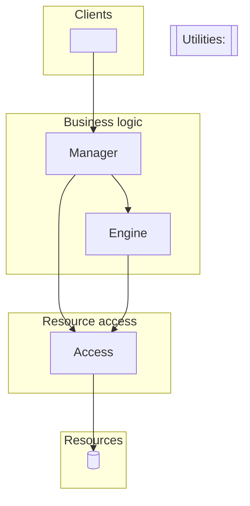

# Design: <system or subsystem name>

**Mode:** inception | subsystem of `<host system>` · **Status:** draft | reviewed
**Date:** <YYYY-MM-DD> · **Scope:** <one line: what is inside the walls, what is not>

> Walls come from volatility (where change is contained). Bricks come from orthogonal
> primitives (how features are assembled). Every wall and every brick below traces to a
> volatility (V-id) or a current feature (F-id). Anything that traces to neither was cut.

## 1. Frame

- **Problem:** <what this system does, for whom, in two sentences>
- **Nature of the business:** <what will not change while this system exists. These are
  deliberately NOT encapsulated.>
- **Constraints:** <deadlines, team, platform, compliance, host-system conventions>
- **Host system (subsystem mode):** <language, framework, where it attaches, owners>

## 2. Features and use cases

| ID | Feature (as the user would say it) | Core use case? |
|----|--------------------------------------|----------------|
| F1 | <...> | yes |
| F2 | <...> | no — variation of F1 |

Core use cases (the few that express the essence of the system; everything else is a
variation of these): <UC1 — ...>, <UC2 — ...>

## 3. Volatility register

| ID | What changes | Axis | Evidence | Likelihood | Contained by |
|----|--------------|------|----------|------------|--------------|
| V1 | <e.g. which channels exist and which vendor delivers each> | over time / across customers | <interview, roadmap, git hotspot, ticket> | high / med / low | <component> |

**Rejected candidates** (considered and deliberately not walled off):

| Candidate | Why not a wall |
|-----------|----------------|
| <...> | variable, not volatile: handled by data/parameters inside one component |
| <...> | nature of the business: if this changes, it is a different system |
| <...> | speculative: no evidence it will change |

## 4. Walls (architecture)



| Component | Type | Encapsulates | Contract (business verbs) | May call |
|-----------|------|--------------|---------------------------|----------|
| <Noun>Manager | Manager | V2 (workflow order) | `<Verb>(...)` | Engines, Access, Utilities; other Managers only via queue |

## 5. Bricks (implementation inside the walls)

Shared contract that makes bricks composable: <the envelope / record / event type every
brick accepts and returns — its fields and invariants>

Composition medium: code | pipeline definition | state-machine table | config — <why>

### <Component name>

| Brick | Kind | Does exactly one thing | In → Out | Serves |
|-------|------|------------------------|----------|--------|
| <Render> | Transform | <fills a template for a locale> | Envelope → Envelope | F1, F3, V3 |

State machines (if any):

```
<state> --event [guard] / effect--> <state>
```

## 6. Feature assembly

Every feature, now and plausible future, written as a composition of existing bricks.

| Feature | Composition | New bricks needed |
|---------|-------------|-------------------|
| F1 | `<Input> → <Transform> → <Transport>` | 0 |
| future: <V1 happens> | `<same, one brick swapped>` | 1 (inside <component>) |

## 7. Validation

**Use-case walkthroughs** (each core use case as a call chain, one call per line):

```
UC1 <name>
  <Client>        → <Noun>Manager.<Verb>
  <Noun>Manager   → <Noun>Engine.<Verb>
  <Noun>Engine    → <Noun>Access.<Verb>
  <Noun>Manager   → <Noun>Access.<Verb>
```

Result: <pass, or which rule broke and how the walls changed>

**Change simulation** (each volatility happening; target is one component touched):

| Volatility | Components that must change | Result |
|------------|-----------------------------|--------|
| V1 | <Component> | pass |

**Rule audit:** <call rules, naming, sizing, smells found and how they were fixed>

**Measured coupling (subsystem mode):** <component pairs from volatility.py above 30%
that a wall now separates, and why the design removes that coupling>

**Cut list:** <walls or bricks considered and removed because nothing traced to them>

## 8. Seams and migration (subsystem mode)

- **Attach point:** <the seam in the host where the subsystem plugs in>
- **Anti-corruption layer:** <component that translates host concepts to this design's
  contract, so host changes stop at it>
- **Steps** (each one shippable on its own; old path deleted last):
  1. <put an abstraction in front of the existing behavior (branch by abstraction)>
  2. <route callers through it>
  3. <build the new implementation behind it>
  4. <switch over, observe, delete the old path>

## 9. Risks and open questions

- <the riskiest assumption in this design, and the cheapest way to test it first>
- <open question — who decides>

## 10. Next steps

- `/argue` this document to check it for contradictions.
- `/quiz-plan` to turn the walls and migration steps into an executable change plan.
