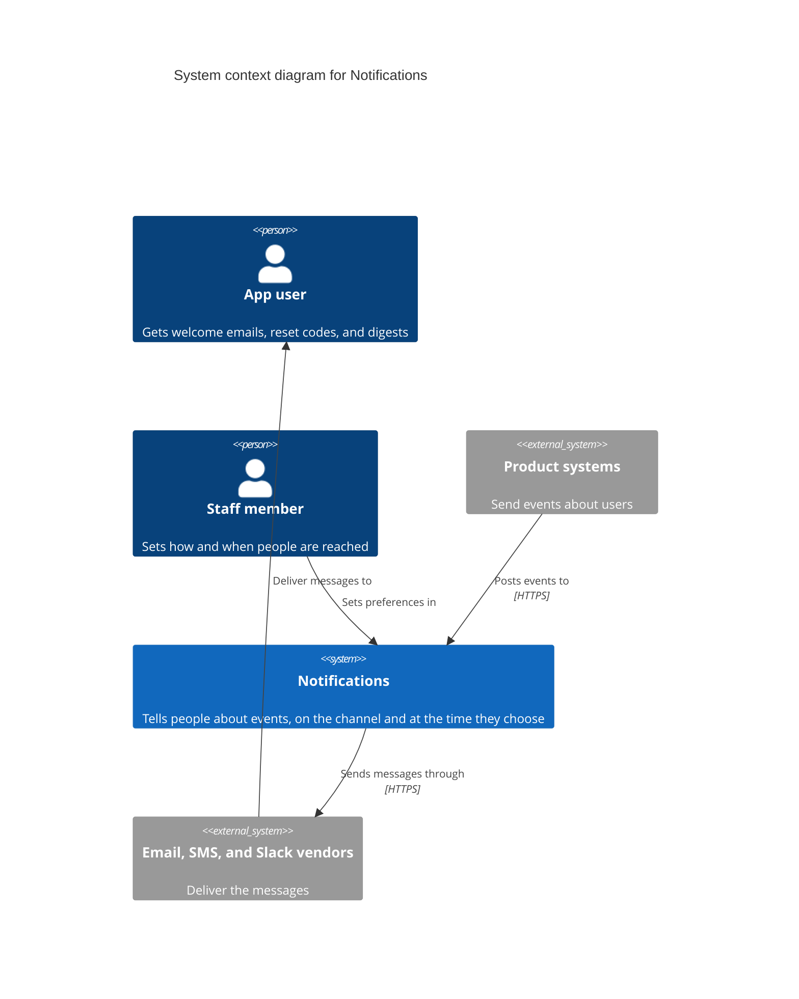
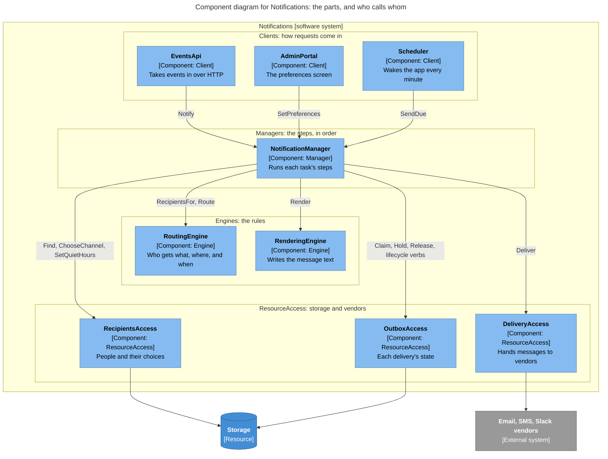
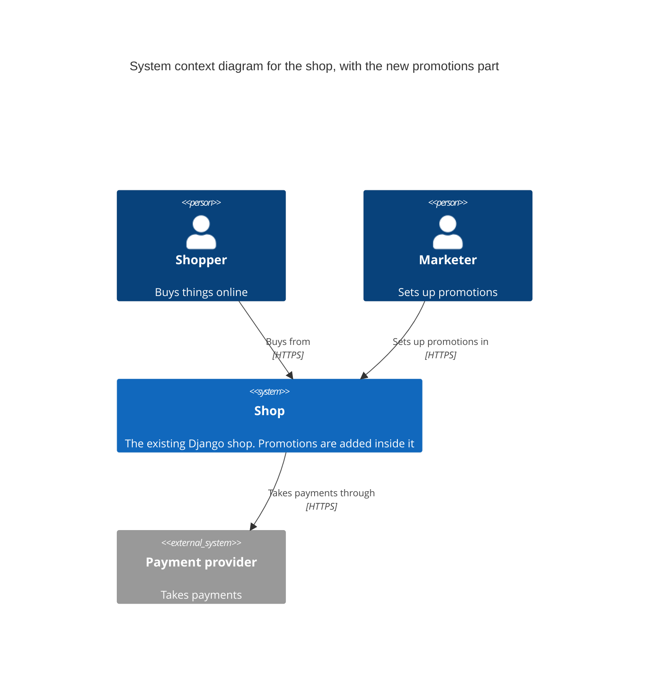

# Worked examples

Two short runs of the method, written the way a design should read: plain English, with
the exact names kept exact. The first starts from a list of features. The second adds a
new part to a shop that already exists, where we measure what changes instead of
guessing.

---

## Example 1 — Inception: a notifications service

**Features**

| ID | Feature |
|----|---------|
| F1 | A welcome email when someone signs up |
| F2 | A password-reset code by SMS |
| F3 | A daily email that sums up activity (the digest) |
| F4 | Alerts for the operations team, posted to Slack |
| F5 | Each person picks the channel they prefer |
| F6 | Quiet hours: nothing that can wait is sent at night |
| F7 | If sending fails, try again |
| F8 | Messages in each person's language |

**Words used here**

- **Volatility**: how likely something is to change.
- **Wall**: the edge of a part. A change inside it shouldn't reach past it.
- **Client, Manager, Engine, ResourceAccess**: the four kinds of part. A Client takes
  requests in. A Manager runs the steps of a task in order. An Engine applies rules. A
  ResourceAccess part talks to storage or an outside service.
- **Brick**: a small piece inside a part that does one job.
- **Envelope**: the record that carries one message through the steps.

**System context**



Key: the blue box is the system we design; grey boxes are other systems; figures are
people. Arrows show who calls whom.

**The trap.** The obvious design makes one service per feature: `WelcomeEmailService`,
`DigestService`, `SlackAlertService`, `RetryService`. Each one repeats the same work:
pick a channel, write the message, send it, remember it. Then adding WhatsApp means
changing every one of them.

**Core use cases.** The eight features are really three tasks:

- UC1: tell people about an event now (F1, F2, F4, F7, F8).
- UC2: tell people about many events later, in one digest (F3).
- UC3: people choose how and when they are reached (F5, F6).

**Nature of the business** (never walled off): the system tells people about events.
Every message has a person and some content. If that stops being true, it's a different
system.

**What is likely to change (volatility register)**

| ID | What changes | Changes over time, or between customers? | Kept inside |
|----|--------------|------------------------------------------|-------------|
| V1 | Which channels exist, and which company delivers each | over time | `DeliveryAccess` |
| V2 | Who gets what, and when: preferences, quiet hours, opt-outs, local rules | between customers | `RoutingEngine` |
| V3 | What messages say: templates and languages | over time | `RenderingEngine` |
| V4 | The steps: send now, send later in a digest, or escalate if unread | over time | `NotificationManager` |
| V5 | Where recipient data lives (our database today, another system later) | over time | `RecipientsAccess` |

Ruled out:

- *The number of retries*: just a setting, not a wall.
- *Fax*: no sign anyone wants it.
- *Stop telling people things*: that's the nature of the business.

**Walls: the parts, and who may call whom**



Key: light blue, a part we build; dark blue, storage; grey, another system. Bands run
top to bottom: Clients, Managers, Engines, ResourceAccess. Arrows are calls, labelled with
the verbs used. No arrow goes up or sideways. Utilities (logging, secrets, pub/sub) are
left out: every part may call them.

| Component | Type | API (business verbs) | Calls |
|-----------|------|----------------------|-------|
| `EventsApi` | Client | `Receive`: `POST /events` | `NotificationManager` only |
| `AdminPortal` | Client | `SavePreferences`: the preferences screen | `NotificationManager` only |
| `Scheduler` | Client | `OnTick`: every minute | `NotificationManager` only |
| `NotificationManager` | Manager | `Notify`, `SendDue`, `SetPreferences` | `RoutingEngine`, `RenderingEngine`, `RecipientsAccess`, `DeliveryAccess`, `OutboxAccess` |
| `RoutingEngine` | Engine | `RecipientsFor`, `Route` | nothing: the Manager looks people up and passes them in |
| `RenderingEngine` | Engine | `Render` | nothing: templates ship with it as files |
| `RecipientsAccess` | ResourceAccess | `Find`, `ChooseChannel`, `SetQuietHours` | storage |
| `DeliveryAccess` | ResourceAccess | `Deliver` | email, SMS, and Slack vendors |
| `OutboxAccess` | ResourceAccess | `Claim`, `Hold`, `Release`, `DueRetries`, `StartAttempt`, `FailAttempt`, `ScheduleRetry`, `GiveUp`, `ConfirmDelivery` | storage |

- `Scheduler` is a client too: time is just another caller. `SendDue` sends held digest
  items and wakes up retries that are due.
- `NotificationManager` is the only part that knows the order of the steps.
- Because we retry, a message could be sent twice. `OutboxAccess.Claim` stops that: each
  (event, person, channel) can be sent only once.
- A delivery's life is a set of business verbs (`StartAttempt`, `FailAttempt`,
  `ScheduleRetry`, `GiveUp`, `ConfirmDelivery`), not one "set the state" call.
- `OutboxAccess` has no row in the register. It hides our own storage, which counts on its
  own.

**Size check.** Two differences from Löwy's usual sizes, both on purpose:

- One Manager, where he usually sees two to five. This service has one family of tasks.
- Two Engines for one Manager, one more than his usual ratio. Routing rules and message
  text change for different reasons, and different people own them. Joining them would
  put two likely changes behind one wall.

**Bricks: the small pieces inside each part**

The shared contract is `Envelope`: the record that carries one message through the steps.

- `Envelope` used by `NotificationManager`, `RoutingEngine`, `RenderingEngine`,
  `DeliveryAccess`: `{ eventId, eventType, recipientId, urgency, channel?, locale?, body?, data }`.
  Tries and receipts belong to the delivery, which `OutboxAccess` keeps.

Inputs make envelopes. Transforms and policies take one and give one back (a policy may
give back none or several). Transports send them out. So any Transform can follow any
other.

| Component | Bricks | Kind |
|-----------|--------|------|
| EventsApi | `OnEvent(type)`: other systems post events to it over HTTP | Input |
| Scheduler | `OnSchedule(cron)` | Input |
| NotificationManager | `Delivery`: pending → sending → delivered, or sending → failed → retrying → sending, or failed → dead | State machine |
| RoutingEngine | `Expand` (event → people), `Prefer`, `QuietHours` | Transform (policy) |
| RenderingEngine | `Render(template, locale)` | Transform |
| DeliveryAccess | `Email`, `Sms`, `Slack`, each `send(envelope) → receipt` | Transport |
| OutboxAccess | `Hold(key, window)`, `Release(due)` | Store |

- The Manager's other job is the wiring: one flow per task, calling the pieces above
  through each part's verbs.
- Flows are plain code for now. They are the same for every customer, and none runs for
  long: the digest is two short flows, with the held items in `OutboxAccess`.
- "Escalate if unread" (V4) would be a long-running flow. If it comes, store the flows
  and run them with a workflow tool, as Löwy does.
- Routing policies are an ordered list for each customer.

Why each brick earns its place:

- `Expand`, `Prefer`, `QuietHours`, `Render`, `Email`, `OnEvent`, and `Delivery` each
  serve two or more features.
- `Sms`, `Slack`, `Hold`, and `Release` serve one feature each. Each is one of the
  choices a recorded change names: a channel in V1, the digest in V4.
- `OnEvent` and `OnSchedule` are Inputs, the way in, so they need no other reason.

Cut: a `Webhook` transport and an `OptOut` policy. No feature needs them today, and no
recorded change names them. Each would be one new brick in one part if it comes.

**Feature assembly: each feature built from the pieces**

| Feature | How it's built | New bricks |
|---------|----------------|------------|
| F1 | `OnEvent(user.created) → Route → Render(welcome) → Deliver` | 0 |
| F2 | `OnEvent(password.reset) → Route[channel=sms] → Render(reset) → Deliver` | 0 |
| F3 | `OnEvent(activity.*) → Route → Hold(daily)` then `OnSchedule(08:00 local) → Release → Render(digest) → Deliver` | 0 |
| F4 | `OnEvent(alert.*) → Route[team] → Render(alert) → Deliver` | 0 |
| F5, F6 | `Prefer` and `QuietHours` inside `Route` | 0 |
| F7 | the `Delivery` state machine | 0 |
| F8 | `Render`'s locale argument | 0 |
| future: WhatsApp (V1) | a `WhatsApp` transport in `DeliveryAccess` | 1 |
| future: escalate if unread in 15 min (V4) | `… → Deliver(push) → Wait(15m, unless read) → Deliver(sms)` | 1 (`Wait`, in the Manager) |
| future: no SMS to EU users at night (V2) | a policy in `RoutingEngine` | 1 |

**Change simulation: if each change happens, what must change?**

| The change | Parts that change | Result |
|------------|-------------------|--------|
| V1: add WhatsApp, or switch SMS company | `DeliveryAccess` | pass |
| V2: a new local rule | `RoutingEngine` | pass |
| V3: a new template or language | `RenderingEngine` (files only) | pass |
| V4: escalate if unread | `NotificationManager` (one new flow, one new `Wait` step) | pass |
| V5: recipients move to another system | `RecipientsAccess` | pass |

**Use-case walkthroughs: each task, call by call**

```
UC1 tell people about an event now
  EventsApi           → NotificationManager.Notify
  NotificationManager → RoutingEngine.RecipientsFor
  NotificationManager → RecipientsAccess.Find
  NotificationManager → RoutingEngine.Route
  NotificationManager → OutboxAccess.Claim
  NotificationManager → RenderingEngine.Render
  NotificationManager → OutboxAccess.StartAttempt
  NotificationManager → DeliveryAccess.Deliver
  NotificationManager → OutboxAccess.ConfirmDelivery

UC2 tell people about many events later
  EventsApi           → NotificationManager.Notify        (ends by holding the item)
  NotificationManager → RoutingEngine.RecipientsFor
  NotificationManager → RecipientsAccess.Find
  NotificationManager → RoutingEngine.Route
  NotificationManager → OutboxAccess.Claim
  NotificationManager → OutboxAccess.Hold
  Scheduler           → NotificationManager.SendDue
  NotificationManager → OutboxAccess.Release
  NotificationManager → RenderingEngine.Render
  NotificationManager → OutboxAccess.StartAttempt
  NotificationManager → DeliveryAccess.Deliver
  NotificationManager → OutboxAccess.ConfirmDelivery

UC3 choose how and when to be reached
  AdminPortal         → NotificationManager.SetPreferences
  NotificationManager → RecipientsAccess.ChooseChannel
  NotificationManager → RecipientsAccess.SetQuietHours
```

No new part is needed, no call goes up or sideways, and each task uses one Manager. Pass.

---

## Example 2 — Subsystem: promotions in a shop that already exists

**Request:** "Add promotions (percent off, staff discount, 3-for-2) to our Django shop."

**Words used here**

- **Seam**: the place where the new part joins the existing code.
- **Coupling**: how often two parts change together.
- **Branch by abstraction**: put a stand-in in front of old code, move everything to the
  stand-in, then swap what's behind it.

**System context**



Key: the blue box is the shop we change; grey is another system; figures are people.

**Measure first.**

```
python volatility.py --path shop --depth 1 --since "18 months ago"
```

| component | commits | days since change |
|-----------|---------|-------------------|
| shop/checkout | 140 | 2 |
| shop/cart | 95 | 5 |
| shop/catalog | 60 | 11 |
| shop/payments | 20 | 94 |

- `shop/cart` and `shop/checkout` change together in 62% of their commits.
- The busiest large files are `checkout/totals.py` (58 commits, 900 lines) and
  `cart/pricing.py` (41 commits).
- Their commit messages say "black friday 20% off", "staff discount", "fix rounding on
  bundle", and "NZ GST change".

**What the numbers say.** The rules for changing prices are what keeps changing. They are
spread across two files, which is why cart and checkout keep changing together. The
checkout *steps* don't change much (`checkout/flow.py`: 4 commits in 18 months), so they
need no new wall.

**What is likely to change (volatility register)**

| ID | What changes | Evidence | Kept inside |
|----|--------------|----------|-------------|
| V1 | Price rules: promotions, staff and bundle discounts | busy files and commit messages | `PricingEngine` (new) |
| V2 | Where promotions are set up (the admin today, a marketing tool later) | the roadmap | `PromotionsAccess` (new) |
| V3 | Tax rules in each region | commit messages | not now; the next candidate |

Ruled out: *rounding rules* (just a setting per currency); *the order of checkout steps*
(the numbers show it's stable).

**Walls, for the new part only.** The shop's cart and checkout keep acting as Managers:
they own the steps, and the steps are stable. Two parts are new:

| Component | Type | API |
|-----------|------|-----|
| `PricingEngine` | Engine | `Quote(basket) → quote` |
| `PromotionsAccess` | ResourceAccess | `ActivePromotions(at)`, `Define(promotion)` |

With only two new parts, the table says it all. So there is no component diagram: C4
says to draw one only when it adds something.

**Where it joins the shop (the seam).**

- The seam is the existing `compute_total(cart)` in `checkout/totals.py`. Cart and
  checkout both call it already.
- `PricingEngine` offers one API in its own words (`Basket`, `Quote`). Evans calls this an
  open-host service.
- `compute_total` becomes one line. It turns the shop's `Cart` into a `Basket` (SKU,
  category, quantity, unit price, customer group) and asks for a quote.
- That translation sits on the shop's side of the seam. Changes to the Django models stop
  there.
- If the engine ever needs more from the shop, it reads through a ResourceAccess part
  over the shop, never by importing Django models.

```
checkout            → compute_total(cart)        seam: turn Cart into Basket
compute_total       → PricingEngine.Quote
PricingEngine       → PromotionsAccess.ActivePromotions
```

**Bricks inside PricingEngine.**

- `Quote` used by `PricingEngine`: `{ lines[], adjustments[], total }`.

| Brick | Kind | Its one job |
|-------|------|-------------|
| `Match(condition)` | Transform (policy) | picks the lines a promotion applies to: by SKU, category, customer group, or dates |
| `PercentOff(n)`, `FixedPrice(x)`, `CheapestFree` | Transform | each adds one kind of discount to the picked lines |
| `BestOf`, `Exclusive` | Transform (policy) | decide which promotions win when several apply |
| `Round(currency)` | Transform | rounds once, at the end |

- A promotion is data: `{match, adjustment}`.
- The engine runs every active promotion, then the rule for choosing winners (`BestOf`
  unless a promotion is `Exclusive`), then `Round`.
- The first draft had one `Adjust(kind)` brick. Its `kind` setting switched between three
  different sums, which is a smell, so it became three bricks.
- `Match(condition)` stays one brick. Its condition is a test the same code runs, not a
  switch between behaviors.
- Cut: `AmountOff`, a per-order or per-customer `Limit`, and a `Sequential` rule for
  choosing winners. No feature needs them today.
- `FixedPrice`, `CheapestFree`, and `Exclusive` serve one feature each. Each is a kind of
  price rule that V1 names.

**Feature assembly**

| Feature | How it's built | New bricks |
|---------|----------------|------------|
| 20% off a category | `Match(category=x) → PercentOff(20)` | 0 |
| Staff discount | `Match(group=staff) → PercentOff(30)`, marked `Exclusive` | 0 |
| 3-for-2 | `Match(sku in set, qty ≥ 3) → CheapestFree` | 0 |
| The existing bundle price (moved from shop code) | `Match(sku in bundle) → FixedPrice(x)` | 0 |
| future: $10 off orders over $100 (V1) | `Match(order_total ≥ 100) → AmountOff(10)` | 1 (`AmountOff`, inside `PricingEngine`) |

**Moving over** (each step can ship on its own):

1. Pin down today's totals with tests over real baskets.
2. Put `PricingEngine.quote(basket)` in front of the current sums, unchanged. This is
   "branch by abstraction".
3. Send both cart and checkout through it. The duplicate sums go away.
4. Rebuild each current discount as promotion data, one at a time, behind a switch. Run
   old and new side by side, and compare the quotes before switching over.
5. Delete the old code.

**Proof.**

- A new kind of promotion changes `PricingEngine` only.
- Moving promotion setup to a marketing tool changes `PromotionsAccess` only.
- Three months after the switch, run `volatility.py` on just those three months
  (`--since <switch date>`), and on the three months before the work began
  (`--since … --until …`).
- `cart ↔ checkout` should now change together much less than 62%. The skill's suggested
  bar is under 30%, where the report stops listing the pair.
- A longer window would mostly count old commits and still show the old number.
- If the number hasn't fallen, the wall leaks, and the design needs another look.
